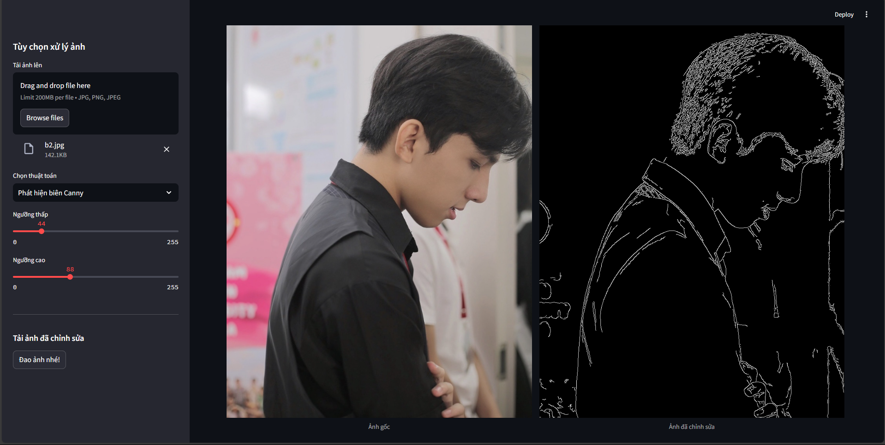
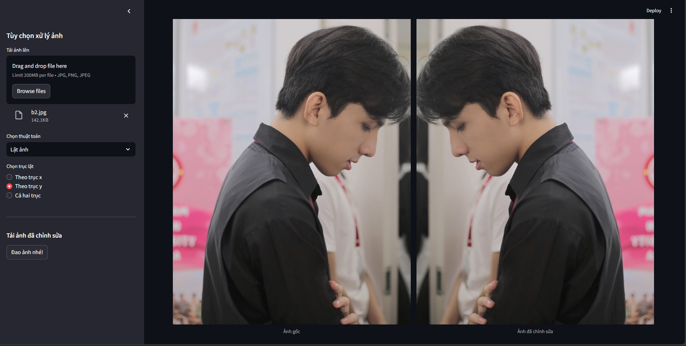

# Computer-Vision
# Ứng dụng Xử lý Ảnh

Đây là một ứng dụng web đơn giản được xây dựng bằng Streamlit, cho phép người dùng tải lên ảnh và áp dụng nhiều thuật toán xử lý ảnh khác nhau. Ứng dụng cung cấp một giao diện trực quan để điều chỉnh các tham số và xem trước kết quả theo thời gian thực.

## Tổng quan

Ứng dụng này tích hợp nhiều kỹ thuật xử lý ảnh phổ biến, bao gồm:

* **Điều chỉnh độ sáng và độ tương phản:** Điều chỉnh độ sáng và độ tương phản của ảnh.
* **Biến đổi không gian màu:** Chuyển đổi giữa các không gian màu khác nhau như HSV, LAB và Grayscale.
* **Gamma Correction:** Điều chỉnh gamma của ảnh.
* **Biến đổi Fourier:** Hiển thị phổ biên độ của ảnh.
* **Biến đổi Wavelet:** Áp dụng biến đổi wavelet Haar.
* **Phát hiện biên Sobel:** Phát hiện biên bằng thuật toán Sobel.
* **Phát hiện biên Canny:** Phát hiện biên bằng thuật toán Canny.
* **Biến đổi Hough:** Phát hiện các đường thẳng trong ảnh.
* **Ngưỡng hóa ảnh:** Áp dụng ngưỡng hóa nhị phân.
* **Phân cụm K-means:** Phân đoạn ảnh bằng thuật toán K-means.
* **Bộ lọc Gabor:** Áp dụng bộ lọc Gabor.
* **Các phép toán hình thái học:** Thực hiện các phép toán hình thái học như erosion, dilation, opening, closing.
* **Bộ xương ảnh:** Trích xuất bộ xương của ảnh nhị phân.
* **Cân bằng Histogram:** Cân bằng histogram của ảnh.
* **Làm sắc nét ảnh (Unsharp Masking):** Làm sắc nét ảnh.
* **Làm sắc nét với Laplacian:** Làm sắc nét ảnh bằng toán tử Laplacian.
* **Thay đổi kích thước ảnh:** Thay đổi kích thước ảnh.
* **Xoay ảnh:** Xoay ảnh theo một góc nhất định.
* **Biến đổi Affine:** Áp dụng biến đổi affine lên ảnh.
* **Biến đổi phối cảnh:** Áp dụng biến đổi phối cảnh lên ảnh.
* **Biến đổi Pyramid:** Giảm kích thước ảnh bằng biến đổi pyramid.
* **Lọc trung bình:** Làm mịn ảnh bằng bộ lọc trung bình.
* **Lọc trung vị:** Loại bỏ nhiễu bằng bộ lọc trung vị.
* **Lọc Gaussian:** Làm mịn ảnh bằng bộ lọc Gaussian.
* **Lọc song phương:** Làm mịn ảnh trong khi vẫn bảo tồn các cạnh.
* **Phân tích kết cấu LBP:** Phân tích kết cấu bằng Local Binary Pattern (LBP).
* **Top-hat trắng và Top-hat đen:** Kỹ thuật hình thái học để làm nổi bật các chi tiết sáng hoặc tối.
* **Dịch chuyển ảnh:** Dịch chuyển ảnh theo trục x và y.
* **Cắt ảnh:** Cắt một vùng cụ thể của ảnh.
* **Lật ảnh:** Lật ảnh theo trục ngang, dọc hoặc cả hai.
* **Color Quantization:** Giảm số lượng màu trong ảnh.


## Cách sử dụng

1. **Cài đặt:**
    * Đảm bảo bạn đã cài đặt Python và pip.
    * Sao chép kho lưu trữ này về máy tính của bạn.
    * Cài đặt các thư viện cần thiết bằng cách chạy lệnh sau trong thư mục của dự án:
        ```bash
        pip install -r requirements.txt
        ```

2. **Chạy ứng dụng:**
    * Mở terminal trong thư mục của dự án.
    * Chạy lệnh sau:
        ```bash
        streamlit run app.py
        ```

3. **Sử dụng ứng dụng:**
    * Tải lên ảnh bằng cách sử dụng trình tải lên tệp trong thanh bên.
    * Chọn thuật toán xử lý ảnh mà bạn muốn áp dụng từ danh sách thả xuống.
    * Điều chỉnh các tham số cho thuật toán đã chọn bằng cách sử dụng các thanh trượt, hộp số, v.v.
    * Xem trước kết quả trong thời gian thực.
    * Tải xuống ảnh đã chỉnh sửa bằng cách nhấp vào nút "Đao ảnh nè".

## Ví dụ

Dưới đây là một số ví dụ về cách sử dụng ứng dụng:

* **Phát hiện biên:** Tải lên ảnh và áp dụng thuật toán Canny để phát hiện các cạnh.
*   
* **Lật ảnh:** Tải lên ảnh và thay đổi ảnh theo trục của nó.
* 

## Lưu ý

* Ứng dụng hỗ trợ các định dạng ảnh JPG, PNG và JPEG.
* Đảm bảo ảnh tải lên có kiểu dữ liệu `uint8` (8-bit).
* Ảnh phải là ảnh xám (2 chiều) hoặc ảnh màu (3 chiều).


## Thư viện được sử dụng

* `streamlit`
* `opencv-python`
* `Pillow`
* `numpy`
* `scikit-image`
* `pywavelets`
* `scikit-learn`
* `matplotlib`


## Góp ý

Mọi đóng góp và góp ý đều được hoan nghênh! Vui lòng tạo một pull request hoặc issue trên GitHub.
